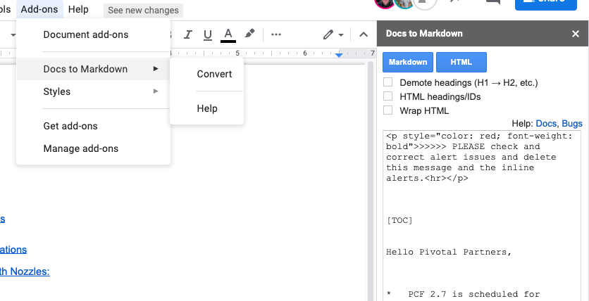

# ISV Docs

[Adding Content](#content)  
[Running and Testing](#running)
[Pipeline](#pipeline)  

## Content

### Use GitHub to add / edit files

OR 

### To work locally

#### Clone this repo, if you have not already done so.

https://github.com/cf-platform-eng/isv-docs

#### Create your working branch

The master branch is protected, so you have two possibilities: work on a branch or work with the github inline editor which will allow you to create branch + PR on save.

For more complex work that needs to be saved/backed up in between we recommend to create a branch directly.

#### Adding content

All content is located in the `content` directory.  [GitLab Markdown Guide](https://about.gitlab.com/handbook/product/technical-writing/markdown-guide/)

#### The top level menu

The `awesome-pages` plugin for mkdoc will automatically add the page to the top level. See [Awesome Pages Plugin Github Repo](https://github.com/lukasgeiter/mkdocs-awesome-pages-plugin) for more information.

### Converting Google Docs

If you have existing documentation in Google Docs,  get the *Docs to Markdown* Add-On to easily convert it.

## Running and testing

Ensure that you have `docker` installed an use the `serve.sh` script to build and run the server locally. It will be served at `http://0.0.0.0:8000`

## Pipeline

The pipeline is running at https://hush-house.pivotal.io/teams/PE/pipelines/isv-docs-deploy.  It's manually triggered.

It is deployed via the `pipeline/set-pipline.sh` script.

The current iteration of this pipline builds the doc from one repistory (isv-docs), the ability to build from multiple repistory can be done in the `collect_docs()` function in the job `deploy-isv-docs`

The docs are hosted here, deployed by the job `build-and-deploy` which creates the html and publishes it to the branch `gh-pages` which is configured for GitHub Pages.

**To use the set-pipeline.sh to set the pipeline you are expected to have the environment variable `CONCOURSE_TARGET_NAME` set which is the name of your "fly target". It could easily go into an `.envrc`file using direnv so you have per project control over your fly target.**
