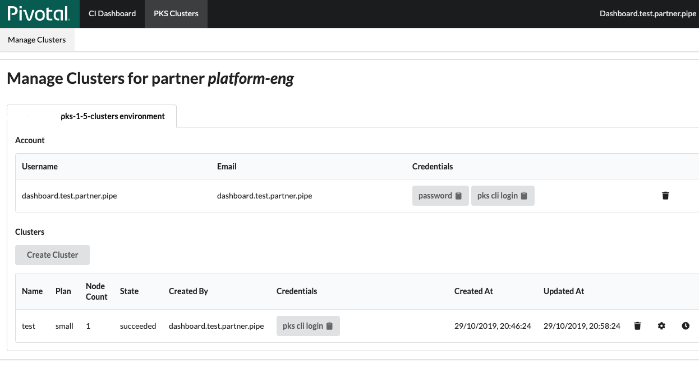
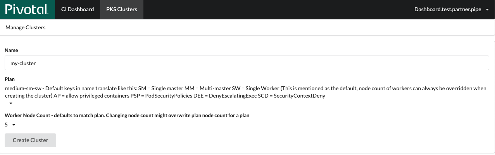

# Pivotal Integration Environments (PIE)

Pivotal operates and manages a number of shared Pivotal Platform development environments,
called Pivotal Integration Environments (PIEs),
for Pivotal Technical Partnership Program (PTPP) program members to develop their integrations.

!!! warning
    PIEs are meant for development purposes only.
    While we strive to keep them up and running for development, they are operated at a *best effort* service level,
    and we strongly advise against using these environments for customer demos and other such purposes.

## Pivotal Container Service (PKS)

To develop an integration with PKS, Pivotal can provide you with a dedicated PKS Kubernetes cluster.
If you would like a development cluster, please request access to the `PKS Clusters` Tab in Tile Dashboard via a message in you partner slack channel. (please note that this needs to be done after every time the PKS Environment gets replaced with a different name and you will only have access to create / remove a cluster, not to the opsmanager for this environment).

After you got added you will see the tab like this:

From there you can copy the pks cli login string, view your clusters or create a new one where you can select the plans (please read their description) and adjust the worker node count (default=1).

Please note that your cluster limit is 2, so you need to delete clusters if you need new ones.

## Pivotal Application Service (PAS)

To develop a PAS integration, Pivotal will provide you with shared access to an environment.
To use your assigned PAS environment:

1. Log in to the Pivotal [Tile Dashboard](https://tile-dashboard.cfapps.io/)
using the credentials that you use for [Pivotal Partners Slack](https://pivotalpartners.slack.com/).
1. Click the `pie-xx` environment assigned to you.
1. Log in to Ops Manager with the given Ops Manager URL and credentials.
1. Log in to Apps Manager or the cf CLI with the Cloud Foundry information provided on the same page.

## Questions?

If you are not in the PTPP or cannot access [Pivotal Partners Slack](https://pivotalpartners.slack.com/),
email [isv@pivotal.io](mailto:isv@pivotal.io).
