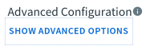
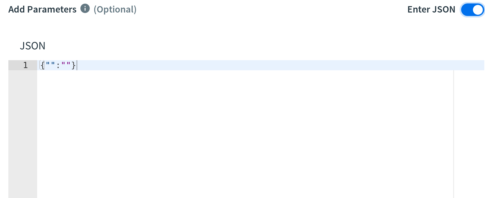

# Tile Development FAQ

## Information about using the Tile-Generator tool

[Tile Generator Docs](https://docs.pivotal.io/tiledev)

## Migrations Output for Tile Upgrade

[Upgrading Tiles](https://docs.pivotal.io/tiledev/tile-upgrades.html)

Defining a migration for your tile and where to look for the output from the `migration` block in the tile.yml

Example

```
migration: |
  console.log("#### example of migration print console.log")
```

SSH into OpsMan Director

You can view the file `/var/log/opsmanger/production.log`

```
I, [2019-06-13T11:30:48.924963 #866]  INFO -- : Valid UAA token
I, [2019-06-13T11:30:49.436807 #866]  INFO -- : BEGIN: Javascript Product Data Migration /var/tempest/workspaces/default/product_data_migrations/tomcat-bosh-tile/0.0.57/201906130720_noop.js output
I, [2019-06-13T11:30:49.436914 #866]  INFO -- : #### example of migration print console.log
```
## What form field types are supported in Apps Manager for on-demand service brokers and how are they configured?

For general information please see the [On-Demand Services SDK](https://docs.pivotal.io/svc-sdk/odb/operating.html) documentation. Note that as of this writing the [plan-schemas](https://docs.pivotal.io/svc-sdk/odb/adapter-reference.html#generate-plan-schemas) use the [JSON Schema draft v4](http://json-schema.org). Although the `array` type is supported in the schema, Apps Manager does not support and thus does not render this type. If one requires the `array` type or other complicated forms we recommend documenting the JSON object layout you wish the customer to use and set the (enable_plan_schemas)[https://docs.pivotal.io/svc-sdk/odb/operating.html#plan-schemas] property to `false`. This will disable any Apps Manager validation and provide an option to a large text box for customers to input a JSON object under `Advanced Options`, see the pictures below.
<br>

<br>
